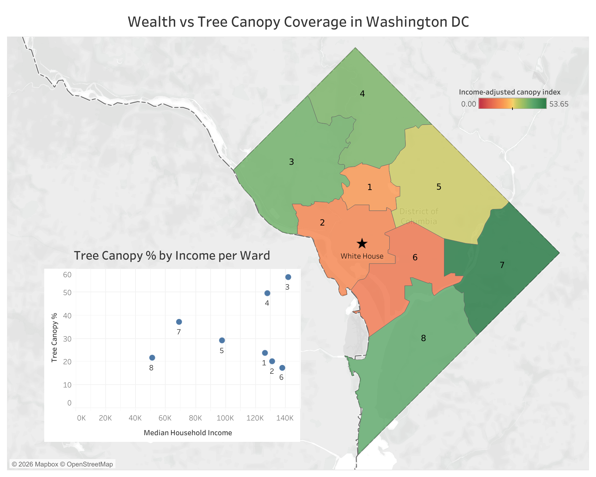

# Urban Tree Equity Analysis (Washington, DC)

## Project Overview

This project explores the relationship between urban tree canopy coverage and socioeconomic conditions across Washington, DC wards.

The goal is to understand whether spatial patterns of green space align with income distribution, and whether central urban areas exhibit differences in environmental equity compared to outer wards.

---

## Key Question

How does tree canopy coverage relate to income levels across DC wards, and are there spatial patterns in environmental equity?

---

## Data Sources

All data is from DC Open Data and U.S. Census ACS 5-Year Estimates:

- ACS 5-Year Economic Characteristics (Income)
- ACS 5-Year Demographic Characteristics (Population)
- Urban Tree Canopy by Ward (2020)
- Parks and Recreation Areas (exploratory dataset)
- DC Ward Boundaries (2022 GeoJSON)

---

## Tools Used

- Python (Pandas, Matplotlib)
- Tableau Public
- GitHub

---

## Data Processing

- Cleaned and standardized ward-level datasets
- Aggregated park counts by ward (exploratory phase)
- Merged income, population, and tree canopy datasets
- Created derived metric:
  - **Canopy–Income Index (exploratory equity indicator)**

---

## Analysis

Two primary relationships were examined:

- Income vs Tree Canopy Coverage
- Income vs Normalized Canopy Equity Index

Spatial patterns were visualized using ward-level mapping in Tableau.

---

## Key Visualization

### DC Ward Tree Canopy Equity Dashboard

- Choropleth map of DC wards
- Color represents canopy relative to income level (equity index)
- Highlights spatial clustering in central DC

---

## Key Findings

- Tree canopy is moderately distributed across DC but varies by ward
- Central wards (downtown DC area) show lower canopy relative to income
- Peripheral wards show higher variability in canopy coverage
- The relationship between income and canopy is weak but spatially patterned

---

## Interpretation

Results suggest that tree canopy distribution in DC is influenced not only by income but also by urban density and land use patterns, particularly in central wards.

---

## Limitations

- Ward boundaries differ across datasets (resolved using 2022 boundaries)
- Parks dataset was exploratory and not included in final model
- Canopy–income index is a relative metric and should not be interpreted as an absolute measure of equity

---

## Future Work

- Expand analysis to other cities in the DMV region (Maryland, Virginia)
- Compare urban vs suburban tree canopy distribution
- Explore land use and housing density as confounding variables
